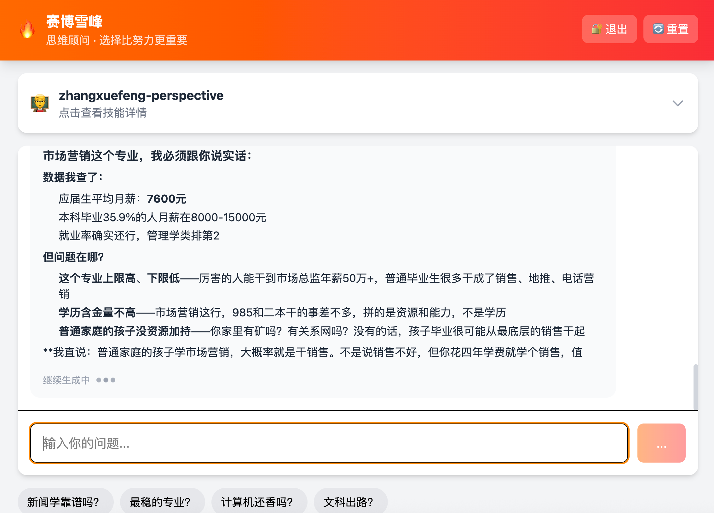

# 赛博雪峰

一个把 `Skill` 快速封装成独立 Web 应用的实验项目。

这里不是去安装和运行一个完整的 Openclaw（龙虾）前端，而是把一个已经写好的技能能力，直接变成一个可访问、可鉴权、可流式输出、可继续扩展的 Web 服务。这样做更轻，改起来更快，也更适合做垂直主题应用。



---

## 技术说明：怎样快速把一个 Skill 封成 Web 应用

核心思路很简单：不要先做“大而全”的 Agent 平台，先把一个 skill 跑通。

### 1. 直接复用 `SKILL.md`

这个项目不是重新发明一套 prompt 系统，而是直接读取现成的 `SKILL.md`，把里面的规则、角色、工作流和边界条件作为 system prompt 注入模型。

这样做的好处是：

- skill 的知识和行为规则都集中在一个地方
- 改 skill，不用改一堆前端或平台配置
- 一个 skill 就能快速对应一个垂直应用

### 2. 用最薄的一层后端包起来

后端只做几件事：

- 加载 skill
- 创建 agent
- 注册工具
- 暴露 `/api/chat`、`/api/skill/info` 这类接口
- 处理鉴权、限流、流式输出

也就是说，重点不是“先装一个复杂平台”，而是“先把 skill 变成一个能用的服务”。

### 3. 工具按应用需要最小化接入

这个项目已经证明了一个垂直 skill 应用常见就这几类工具：

- `list_skill_files`
- `read_skill_file`
- `web_search`

先把这几类工具接好，skill 就已经能做相当多的事情。  
没必要上来就引入一整套平台级工具面板、插件市场和全量运行时。

### 4. 前端也保持轻量

前端只保留最必要的能力：

- 登录验证
- 对话输入
- SSE 流式输出
- Markdown 渲染
- 技能信息展示

这套结构的价值在于，后续你想把别的 skill 做成 Web 应用时，基本就是替换 skill 路径、工具组合和页面文案，不用从头造轮子。

### 5. 为什么不是先装 Openclaw（龙虾）

不是说 Openclaw 不好，而是这个项目要解决的问题不是“搭一个通用 Agent 平台”，而是：

**怎么把一个 skill 尽快做成一个能直接给人用的独立产品。**

如果目标是验证一个垂直人物视角、行业顾问、领域助手是否成立，那么：

- 直接封装 skill 成 Web 应用，路径更短
- 功能边界更清楚
- 修改成本更低
- 更容易做成一个单用途、强主题、可快速迭代的小产品

一句话：

**先把 skill 产品化，再考虑平台化。**

---

## 项目初心：纪念张雪峰，赛博永生

这个项目不是为了简单做一个“模仿说话风格”的聊天机器人。

它更像是一种纪念，也是一种延续。

张雪峰之所以被那么多人记住，不只是因为他说话直接、风格强，而是因为他在很多关键问题上，替普通家庭把很多难听但重要的话提前说了出来：

- 选择比努力更重要
- 信息差会决定很多人的命运
- 普通家庭最怕的不是不努力，而是方向选错
- 教育、专业、城市、行业，背后都是现实的人生分叉口

“赛博雪峰”想做的，不是神化谁，而是尽量把这种面向普通年轻人和家长的判断框架保存下来、继续用下去。

对于很多年轻人来说，人生最难的阶段不是高考那三天，而是之后一次次选择：

- 选什么专业
- 去哪个城市
- 做什么工作
- 要不要考研
- 家庭资源一般时，怎么少走弯路

对于很多家长来说，焦虑也不是因为不爱孩子，而是因为信息太乱、选择太多、代价太高。

所以这个项目保留的，不只是一个“角色”，更是一套尽量站在普通人一边的人生判断方式。

如果说肉身会离开，那有些东西未必要一起消失。

把公开言论、思维框架、判断习惯、表达方式整理下来，继续服务后来的人，这本身就是一种赛博意义上的延续。

可以把它理解成一句话：

**记念张雪峰，也希望他继续以另一种形式，给年轻人和家长当人生指南。**

---

## 当前项目特点

- 基于 `SKILL.md` 直接构建角色能力
- 支持按需读取 skill 补充资料
- 支持 Web 搜索补充时效性信息
- 支持密码验证、限流、流式输出
- 支持把一个垂直 skill 快速做成独立 Web 应用

---

## 启动（Cloudflare Workers）

```bash
npm install
npx wrangler kv namespace create cyberxuefeng-preview --preview --update-config=false
npx wrangler kv namespace create cyberxuefeng-production --update-config=false
# 把返回的 namespace id 填到 wrangler.jsonc
npx wrangler secret put API_KEY
npx wrangler secret put AUTH_PASSWORD
npx wrangler secret put TAVILY_API_KEY
npx wrangler secret put GEMINI_API_KEY
npm run kv:sync-skill
npm run dev
```

本地启动后访问：

- `http://localhost:8787`

### 部署

```bash
npm run deploy
```

当前线上部署已验证可用，关键变量通过 `npx wrangler secret put <NAME>` 注入 Worker。

### 技能资料同步到 KV

当前分支默认从 Cloudflare KV 读取技能内容，不再依赖本地 `SKILL_PATH`。

```bash
npm run kv:sync-skill
```

默认会把 `skills/zhangxuefeng-perspective` 下的文本资料上传到 `APP_KV`，并生成目录索引供：

- `list_skill_files`
- `read_skill_file`

两个工具读取。

### `wrangler.jsonc` 的 `vars` 与 `.dev.vars`

- `wrangler.jsonc` 里的 `vars`：Worker 绑定的普通环境变量，适合放 **非敏感默认配置**
- `.dev.vars`：本地开发可用的 dotenv 文件，适合本地调试时放密钥
- `wrangler secret put`：线上/远端部署时的密钥注入方式，适合放真正的敏感值

这套项目里建议这样用：

- `vars` 放：`SKILL_SLUG`、`SEARCH_PROVIDER`、`OPENAI_MODEL`、限流阈值
- 本地开发可放到 `.dev.vars`：`API_KEY`、`BASE_URL`、`AUTH_PASSWORD`、`GEMINI_API_KEY`、`TAVILY_API_KEY`
- 线上部署统一用 `wrangler secret put`
- **不要**把 `API_KEY` 这类密钥写进 `vars`

另外，本项目的 `kv_namespaces.APP_KV` 已设置 `"remote": true`，所以 `wrangler dev` 会直接访问你配置的远端 KV，而不是本地模拟 KV。

---

## 适合继续扩展的方向

- 把更多 skill 复用成独立 Web 应用
- 做多 skill 切换，而不是单 skill 页面
- 增加服务端会话和多用户隔离
- 增强 Markdown 渲染和前端展示
- 补充更多角色型、顾问型、行业型 skill
